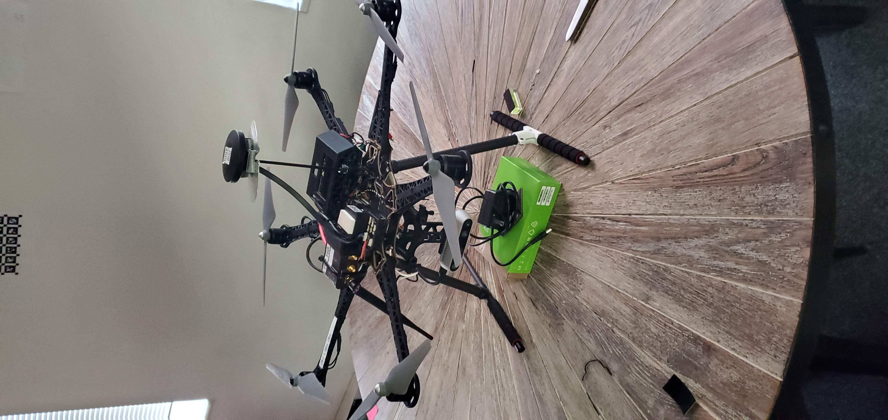
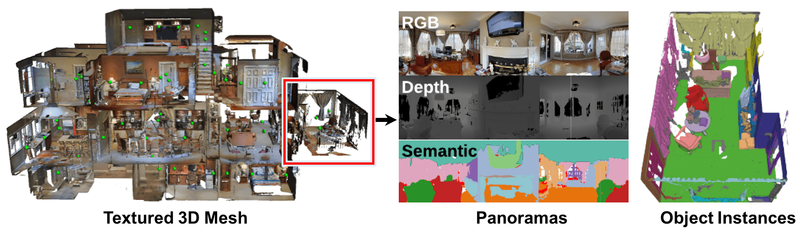

# Directory
Navigating my github made easier.  
Check out my [resume](resume.md)

## Github Projects

### [Path Planning / Navigation Robot](https://github.com/nikopoulospet/rbe3002)
This project involved creating a simulated robot in ROS and Gazebo. The goal was to autonomously map and navigate a random maze under a 5 minute time limit. The resulting robot was very successful and I invite you to take a look at the git repo.

  

Here is a brief presentation that covers the basic functionality of this robot. 
  
https://docs.google.com/presentation/d/1sP6OZyR7GFrnltFu_WdF3-0a_2Va9bV9yntR3m7LxwY/edit#slide=id.gb0be1dad54_0_0

### [MultiThreaded Game of Life](https://github.com/nikopoulospet/project3)
This is an implimentation of the game of life that utilizes multithreading to run faster. The multithreading is done manually in C++ using system calls to the linux kernel. 

  

  

### [Othello game playing AI](https://github.com/nikopoulospet/Othello-AI)
This is an AI designed to use A-B pruning and Minimax to play the game of Othello on an 8 by 8 board. Open Ai's Gym was used as a training and benchmarking enviroment to train a Deep Q network agent in addition to the minimax agent.

  

  

## Other Projects
### IAM Robotics Intern Project

  

### Autonodyne Intern Project
The goal was to create an autonomous sentinel drone that would activate and begin flying upon the detection of movement. The drone was fitted with a pixhawk flight controller, nvidia jetson nano, intel d435 and various other sensors. My contribution to this project ranged from the physical maintenance of this drone and its sensor mounts, network setup of the drone and the base computer, development of the drone’s ROS based control software, and development of computer vision object detection and classification algorithms to enable new behaviors.

  

### Social Legged Robot

  

### [3D Reconstruction](reconstruction/paper.md) 

  

